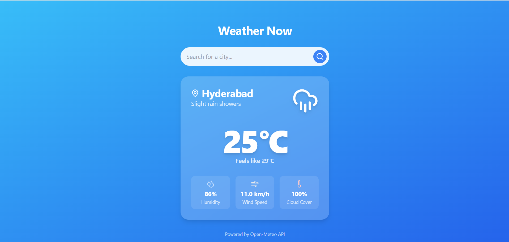

<div align="center">
  
</div>

# 🌦️ Weather Now — Real-Time Weather App

**Weather Now** is a modern, fast, and responsive weather web application built with **React**, **Vite**, and **TypeScript**.  
It fetches **real-time weather data** based on your current location or any searched city — with a clean, minimal interface and quick load times.  
If location access is denied, it defaults to **Hyderabad** for convenience.

---

##  Features

-  **Real-Time Weather Data** – Displays temperature, humidity, and weather conditions using OpenWeather API (or your VINODHRK API).  
- **Location Detection** – Automatically detects user’s current location with geolocation API.  
- **City Search** – Instantly fetches weather by city name.  
- **Responsive Design** – Works seamlessly across desktop and mobile.  
- **Blazing Fast** – Built using **Vite** and **React 19 hooks** for top performance.  
-  **Fallback Support** – Defaults to **Hyderabad** when geolocation is denied.  

---

## 🛠️ Tech Stack

| Technology | Purpose |
|-------------|----------|
| **React 19 + TypeScript** | Core frontend framework |
| **Vite** | Build tool and dev server |
| **OpenWeather / Custom API** | Weather data source |
| **Geolocation API** | Location detection |
| **CSS / Material UI / Tailwind** | UI and styling |
| **Node.js** | Runtime environment |

**Clone the repository**
   ```bash
   git clone https://github.com/Vinodhrk7/weather-now-app.git

1. Install dependencies:
   `npm install`
2. Set the `VINODHRK_API_KEY` in [.env.local](.env.local) to your Vinodhrk API key
3. Start the development server:
   `npm run dev`
